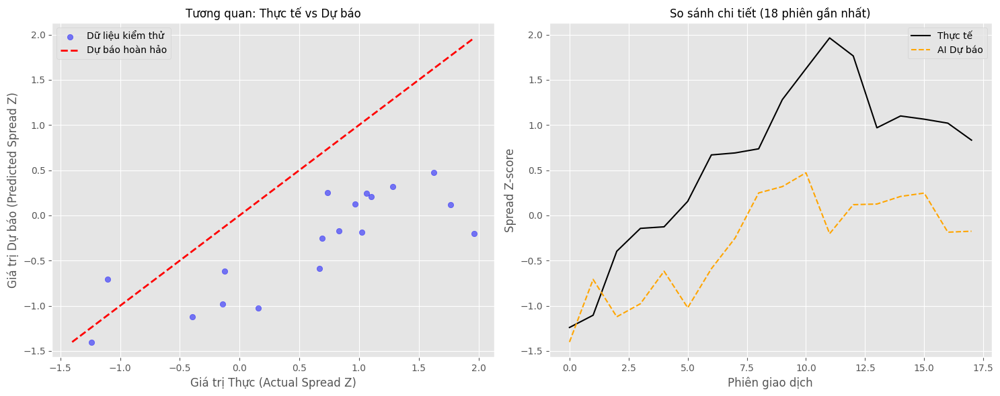
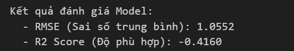
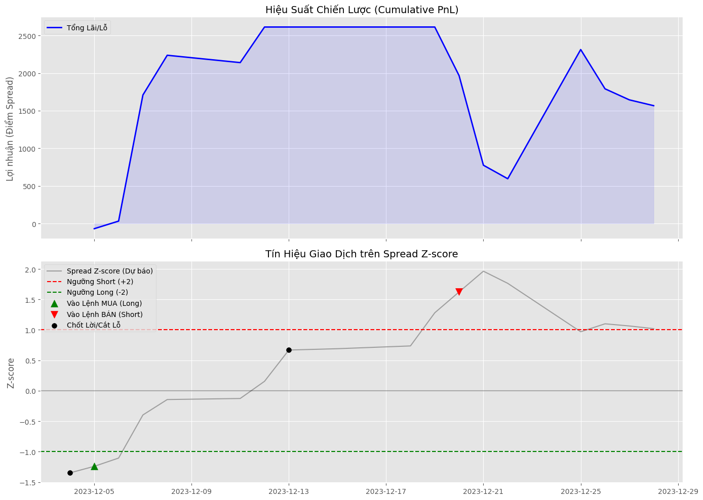
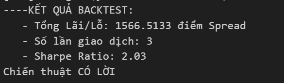

# TÍNH TOÁN TÀI CHÍNH
Đồ án giữa kỳ môn tính toán tài chính \
Mục đích: Ứng dụng máy học và phân tích tài chính để xây dựng hệ thống giao dịch định tính nhằm tạo tín hiệu giao dịch từ dữ liệu cổ phiếu trên Yahoo Finance\
Kết hợp giữa: momentum, machine learning và pair trading để tạo tín hiệu giao dịch \
Pipeline: DataLoader -> DataProcessor -> Feature_layer -> Model_layer -> Strategy_layer 
## Một số kiến thức được sử dụng
1. **Kiểm tra tính dừng của chuỗi thời gian**\
Trong mô hình dự báo tài chính và phân tích chuỗi thời gian, việc đánh giá tính dừng là bước quan trọng để tránh hiện tượng hồi quy giả (spurious regression).\
Nhóm sử dụng kiểm định Augmented Dickey–Fuller (ADF) để kiểm tra tính dừng của chuỗi giá (Adj Close):
- Giả thuyết gốc (H0): Chuỗi thời gian không dừng
- Giả thuyết đối (H1): Chuỗi thời gian dừng
Nếu giá trị p-value < 0.05, ta bác bỏ H0 và kết luận rằng chuỗi thời gian có tính dừng.
Trong trường hợp dữ liệu không dừng, dự án áp dụng các kỹ thuật chuyển đổi phổ biến như:
- Log return transformation
- First differencing
nhằm đưa dữ liệu về trạng thái dừng (trung bình, phương sai và hiệp phương sai không đổi) trước khi đưa vào mô hình máy học hoặc thuật toán giao dịch.
2. **RSI (Relative Strength Index)**: \
Chỉ báo RSI so sánh tỷ lệ tương quan giữa số ngày tăng giá so với số ngày giảm giá với dữ liệu giao động trong khoảng từ 0 đến 100 (mức trung bình là 50)\
Công thức: 
$$
RSI = 100 - \frac{100}{1 + RS}, \quad RS = \frac{AvgGain}{AvgLoss}
$$
3. **ROC (Rate of Change)**:\
 ROC được tính bằng cách so sánh giá hiện tại với giá tại "n" khoảng thời gian trước. Biểu đồ tạo thành một bộ dao động dao động trên và dưới đường 0 khi ROC chuyển từ tích cực sang tiêu cực
 Công thức:
$$
ROC = \frac{Price_t - Price_{t-n}}{Price_{t-n}} \times 100
$$
4. **Tìm cặp đồng tích hợp**: dùng kiểm định cointegration: xác định xem có mối tương quan giữa một số chuỗi thời gian trong dài hạn hay không. Trong hệ thống, mình đang sử dụng chuỗi dữ liệu một chiều, ở đây nhóm dùng phương pháp Engle-Granger Two-Step để kiểm định. \
- Gỉa thuyết gốc (H0): không đồng tích hợp
- Gỉa thuyết đối (H1): có đồng tích hợp 
Nếu giá trị p-value < 0.05 thì ta bác bỏ H0\ 
Khi đó, hệ thống đánh dấu và lưu lại cặp tài sản này để tiếp tục tính toán spread, z-score và đưa tín hiệu giao dịch.
Spread = khoảng cách giá giữa 2 cổ phiếu được hedge bằng β\
Z-score = chuẩn hóa spread so với trung bình và độ lệch chuẩn -> dùng để tạo tín hiệu mua/bán.\
Công thức spread: \
$$
spread_t = Price_A - \beta \cdot Price_B
$$
Công thức z-score:\
$$
z = \frac{spread - \mu}{\sigma}
$$
5. **Khoảng cách tới SMA**: đo xu hướng dài hạn \
- Nếu đường dist_sma > 0 -> giá đang nằm trên đường xu hướng -> thị trường tăng 
- Nếu đường dist_sma < 0 -> giá đang nằm dưới đường xu hướng -> thị trường giảm 
- Biên độ càng lớn thì xu hướng càng mạnh
6. **MACD (Moving Average Convergence Divergence)**: đo sức mạnh và độ thay đổi của xu hướng 
7. **Bollinger**:
Công thức: \
$$ Upper = SMA + 2\sigma, \qquad Lower = SMA - 2\sigma $$
## Cách cài đặt và pipeline
### Cách cài đặt 
1. Clone repo
```bash
git clone https://github.com/qz4ng/CF_Giang_23280052_Kien_23280066.git
cd CF_Giang_23280052_Kien_23280066
```
2. Cài đặt thư viện 
```bash
pip install -r requirements.txt
```
### Pipeline   
1. DataLoader: 
- tải dữ liệu từ Yahoo Finance 
- xử lý index và chuẩn hóa định dạng DateTime
- nhập dữ liệu từ file trên máy (hỗ trợ định dạng csv, xlxs và xls)
2. DataProcessor: làm sạch dữ liệu
- xử lý missing values (dữ liệu tải từ Yahoo Finance đã được xử lý)
- xử lý outlier (dữ liệu tải từ Yahoo Finance đã được xử lý)
- kiểm tra chuỗi dừng và xử lý 
- tạo log-return và scale dữ liệu 
- đồng bộ thời gian của các mã cổ phiếu 
3. Feature_layer: tạo các đặc trưng cho mô hình 
- momentum indicators: RSI và ROC 
- pair indicators: tìm cặp đồng tích hợp, tính spread và z-score
- trend indicators: sma distance và macd
- volatility indicators: bollinger band
4. model_layer: 
- chia tập dữ liệu 
5. strategy_layer:
- logic tạo tín hiệu 
- đánh giá hiệu suất của hệ thống và lợi nhuận 
- plot
# Kết quả:



*Đánh giá mô hình*




*Hiệu suất mô hình*
## Thành viên nhóm 
Trần Trung Kiên 23280066\
Trương Thị Quỳnh Giang 23280052